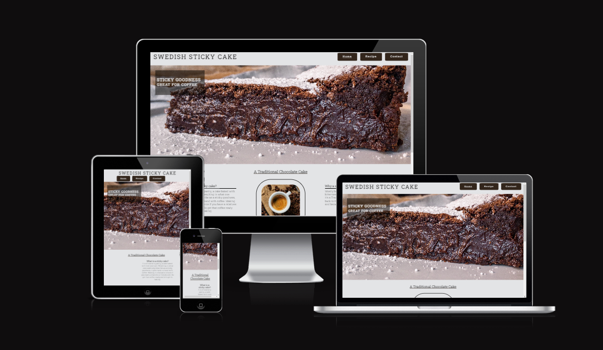
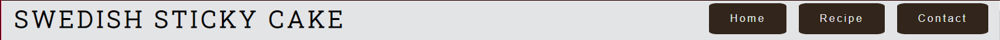
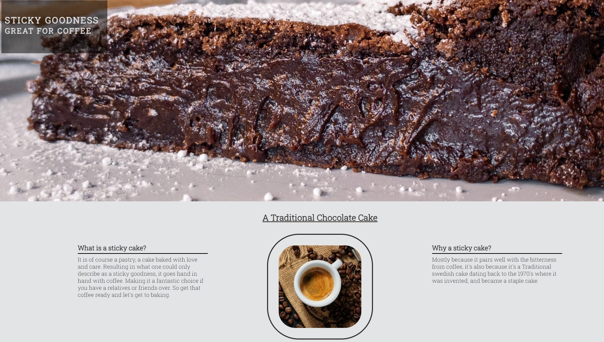
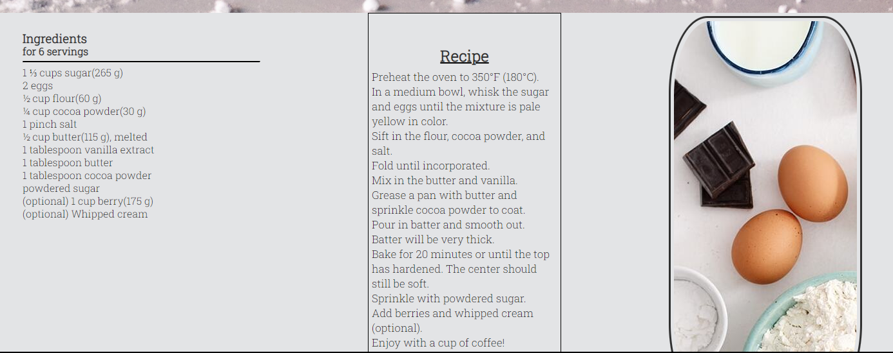
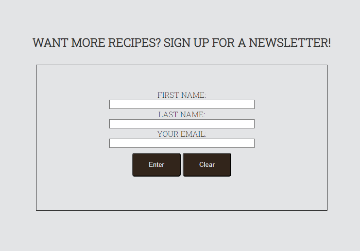
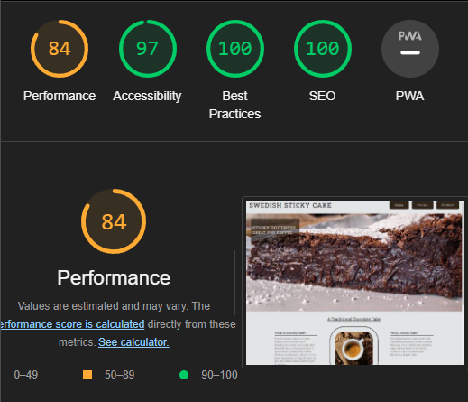

# Swedish Sticky Cake

The Swedish Sticky Cake Website, is at it's core a recipie website that gives instructions on how to prepare a sticky cake for consumption.

## Features

### Existing Features

- __Nav Bar__

  - Avaliable on all pages, does not change as not to confuse the user of the page, through this navigational bar and buttons one can easily navigate around the page without having to press the back button.

- __The landing page image__

  - This page features a picture of a very nice and molten sticky cake, which also has some quick information about it. 
 

- __Recipe Page__

  - This is the Recipie page, where the recipie is held and ingredients are shown.
  - It also shows how to prepare and bake the cake.

- __The Footer__

  - The footer includes links to the corresponding icons shown on it

- __The Sign Up Page__

  - This page will allow the user to take contact the creator of the page to not only get a newsletter and new recipies when they get cooked up.

### Features Left to Implement

- I would have liked to make the buttons more animated and responsive, maybe add some animations.

## Testing

I have tested the site in the following browsers; Chrome, Microsoft Edge and Firefox, it worked the same in all three browsers.

I confrimed that my page is responsive via the devtools in Chrome, I also tested the site on my phone.

I have confirmed that the links open up to the corresponding sites and in a new browser window.

I have confirmed that the form works and requires an email to beable to submit, and I used a custom response page to redirect the user.

### Validator Testing

- HTML
  - No errors were returned when passing through the official W3C validator
- CSS
  - No errors were found when passing through the official (Jigsaw) validator
- Accessibility

## Deployment

- The site was deployed to GitHub pages. The steps to deploy are as follows:
  - In the GitHub repository, navigate to the Settings tab
  - From the source section drop-down menu, select the Master Branch
  - Once the master branch has been selected, the page will be automatically refreshed with a detailed ribbon display to indicate the successful deployment.

The live link can be found here - <https://i-am-frend.github.io/sticky-cake/>

## Credits

Thanks to my Mentor Alex for pointing me in the right direction, and helping me get on the right path.

I used W3Schools and Stack-overflow for problems that were quite over my head.

### Content

- The Text for the Recipie taken from [Tasty.co](https://tasty.co/recipe/swedish-sticky-chocolate-cake-kladdkaka)
- Instructions on how to implement the form was taken from [W3schools](https://www.w3schools.com) and [Stack-Overflow](https://stackoverflow.com)
- The icons in the footer were taken from [Font Awesome](https://fontawesome.com/)
- I used templates from Code Institute and Snippets of Code from the Love Running project that they provided, and customized them for my page

### Media

- The photos used on the home and recipie are from This [Pexels](https://www.pexels.com)
